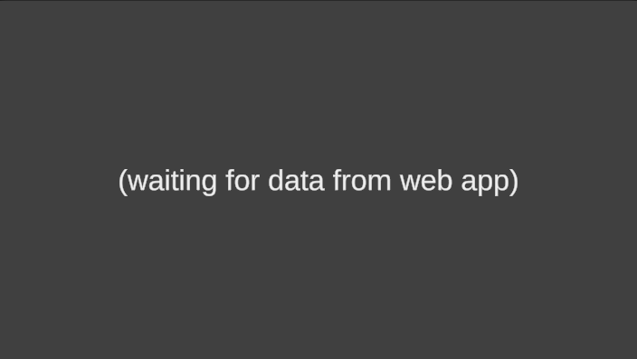
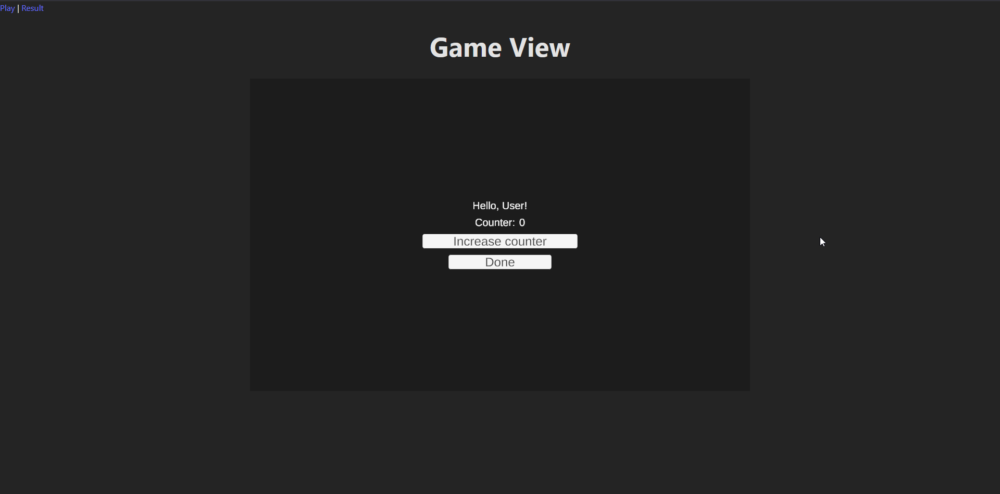
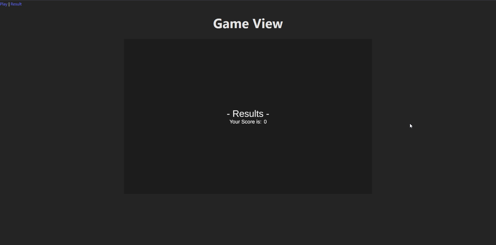
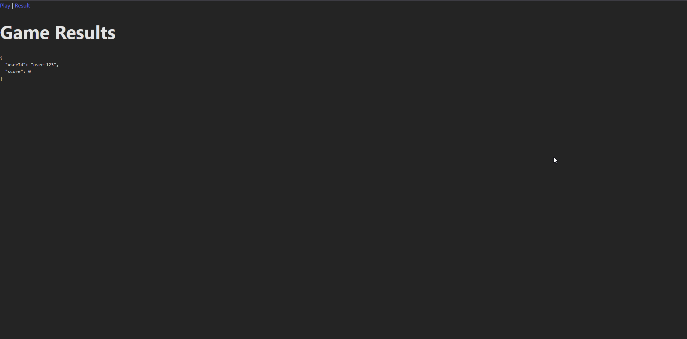

# Unity WebGL + React integration demo

A small, reusable demo that shows how to integrate a Unity WebGL build into a React app and how to communicate between the two. Check`src/pages/UnityPage.jsx` for a practical example.

# TL;DR

- Example in `pages/UnityPage.jsx`
- You can probably reuse the `UnityGame.jsx` component in other project as is. It creates a Unity player and exposes messaging.
- Listen to events with `eventBus.subscribe()`
- Send events with `unityApi.send()`


## Quick start

```bash
npm install
npm run dev
```
open http://localhost:5173


## Communication Flow
Example usage from `src/pages/UnityPage.jsx`:

```js
// send initial payload when Unity is ready
unityApi.whenReady().then(() => {
  unityApi.send(
    { action: 'startRound', userId: 'user-123' },
    'JSEventManager', // Unity GameObject name
    'OnStartRound'    // method on that GameObject
  );
});

// subscribe to typed messages
import eventBus from './unity/unityEventBus';
const unsub = eventBus.subscribe('GameResult', (payload, meta) => {
  console.log('GameResult from Unity:', payload);
});
// unsub() when you no longer want updates
```


### 📤 React → Unity: Send User Data
The bundled example Unity project expects to receive some user data, or it won't start.
- I've set up in unity an object called 'JSEventManager' that will listen for the message 'OnStartRound', and read the payload that goes with it.
It will look like this while waiting for some data:



- Send a message to the loaded unity instance with `unityApi.send()`

<hr>

### 📥 Unity → React: Receive Game Results

This demo unity project features a simple interface that shows the passed user name and has a counter.


When you click "Done", the game ends and takes us to a results screen.
- When reaching the results screen, from Unity we send the message `GameResult`, with a JSON payload with our results.



Then, if you navigate to the other page in the app (http://localhost:5173/result) there you can see the JSON payload we received from Unity.



Note: We use GameResultContext.Provider to store the results locally, but ideally we would use some backend integration.

## Files of interest

- `src/components/unity/UnityGame.jsx`: React component that mounts the canvas, shows a loader overlay, and wires the bridge to the created Unity instance. You can probably reuse this component as is
- `src/pages/UnityPage.jsx`: The go-to example that shows how to send an initial payload to Unity and how to handle results coming from Unity.
- `src/unity/unityApi.js`: Public API used to send messages and register handlers.
- `src/unity/unityBridge.js`: Low-level bridge that holds the Unity instance, queues outgoing messages and normalizes incoming events.
- `src/unity/unityEventBus.js`: Lightweight typed event bus built on top of the bridge for subscribing to Unity message types.
- `src/unity/useUnityLoader.js`: Hook that injects Unity loader script and creates the Unity instance.
- `public/Build/*`: The Unity WebGL build artifacts used by the demo (loader, framework, wasm, data files).


## `UnityGame` component props

`src/components/unity/UnityGame.jsx` exposes a small set of props to customize the loader and canvas:

- `canvasStyle`: style object passed to the `<canvas>` element (default: `{ width: 960, height: 600, background: '#000' }`).
- `dataUrl`: path to Unity `.data` file (default `/Build/UnityGame.data`).
- `frameworkUrl`: path to Unity framework JS (default `/Build/UnityGame.framework.js`).
- `codeUrl`: path to Unity `.wasm` file (default `/Build/UnityGame.wasm`).
- `loaderSrc`: path to the Unity loader script (default `/Build/UnityGame.loader.js`).
- `onReady`: optional callback invoked with `{ unityInstance }` when Unity is ready.

The component uses the `useUnityLoader` hook to inject the loader script, create the instance, and expose loading state. It also wires `unityBridge` with the created instance so that `unityApi` works as expected.

